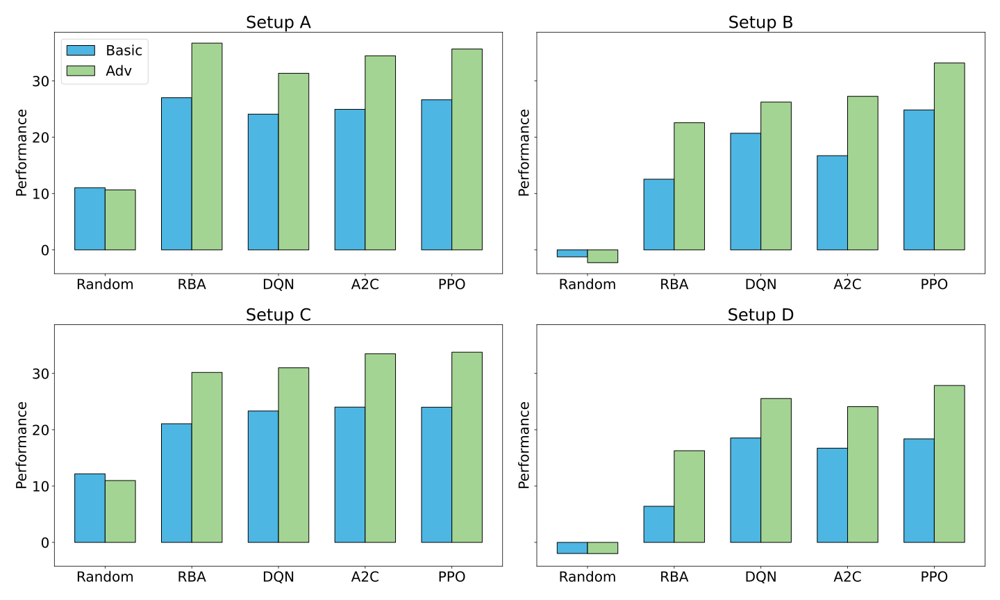

# SortingEnv: Extendable RL-Environment for an Industrial Process ♻

[](https://www.python.org/downloads/release/python-390/)
[](https://pypi.org/project/autopep8/)
[](https://opensource.org/licenses/MIT)
[](<(https://img.shields.io/badge/dependencies-up%20to%20date-brightgreen)>)

_What strategies enable RL systems to efficiently respond to unforeseen changes in the action or observation space, especially in contexts where rapid adaptations are critical?_

This is a research project that aims to develop a flexible environment for reinforcement learning (RL) that allows for experimenting with handling adaptations optimally. The environment is based on an industrial sorting process, where the goal is to sort objects into different categories. It is designed to be modular and flexible, allowing for easy changes in the action and observation space.

1. **Changes in Action Space:** E.g. control belt speed, select sorting mode
2. **Changes in Observation Space:** E.g. new sensors, new data categories

---
**Note:❗️**This is the code for the (upcoming) publication **SortingEnv: An Extendable RL-Environment for an Industrial Sorting Process** (Maus es Al., in preparation)

---

## 🤖 Environment-Design

This is the basic scheme of the [gymnasium](https://gymnasium.farama.org/index.html)-based environment, inspired by an industrial sorting process. For more details, see [Docs](docs/Environment.md).

- **Simple Enviroment:** Quantity Sensor (Observation) || Change Speed (Action)
- **Complex Environment:** Quantity + Material Sensor (Observation) || Change Speed + Select Sorting Program (Action)


---

## 🏗 Folder Structure

```
📦Sorting_Env_2024
 ┣ 📂docs                 --> Documentation, Manual
 ┣ 📂img                  --> Image output folder
 ┣ 📂log                  --> Logging folder (Tensorboard,..)
 ┣ 📂models               --> Storage for trained models
 ┣ 📂scripts              --> Scripts for additional plots
 ┣ 📂src                  --> Environment-Files, Testing, Training
 ┃ ┣ 📜env_1_simple.py
 ┃ ┣ 📜env_2_adv.py
 ┃ ┣ 📜input_generator.py
 ┃ ┣ 📜rule_based_agent.py
 ┃ ┣ 📜testing.py
 ┃ ┗ 📜training.py
 ┣ 📂utils                --> Benchmark, Plotting, Simulation
 ┃ ┣ 📜benchmark.py
 ┃ ┣ 📜plot_env_stats.py
 ┃ ┣ 📜plotting.py
 ┃ ┗ 📜simulation.py
 ┃ ┣ 📜tuning.py
 ┣ 📜Readme.md
 ┣ 📜main.py              --> Main File: Parameter-Style
```

---

## 📚 Setup

Follow these steps to set up the environment on your local machine.

```bash
git clone https://github.com/Storm-131/Sorting_Env_2024.git
cd Sorting_Env_2024

conda create -n sorting_env python=3.11
conda activate sorting_env
pip install -r requirements.txt  # See also docs/requirements_conda.txt
```

---

## 🚀 Quickstart

To run the environment, you can use the `main.py` file. This file allows you to set the parameters for the environment and the agent.
```bash
# Set parameters in the file and run the environment
python main.py
```

---

## 🎥 Environment-Simulation (Video)

## 

## 📊 Benchmarking

The environment has been benchmarked using multiple RL algorithms (`stablebaselines3`), with a baseline agent ("Test") choosing random actions. The benchmarking script can be found in the `utils` folder.



---

## Contact 📬

For questions or feedback, feel free to reach out to me at:

[📧 Tom.Maus@ini.rub.de](mailto:tom.maus@ini.rub.de)

---

